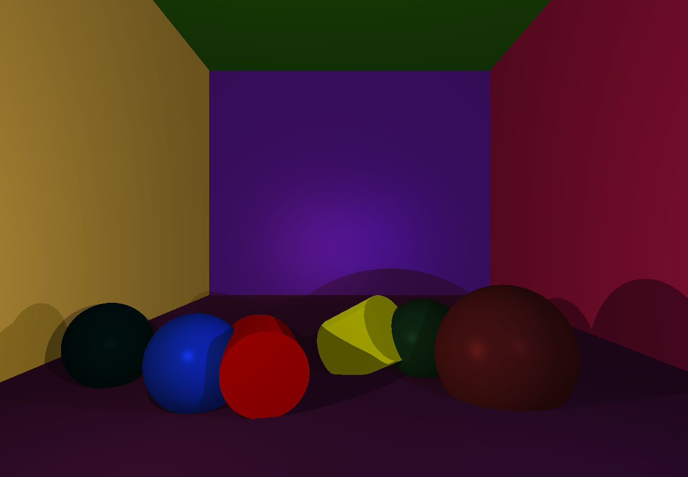
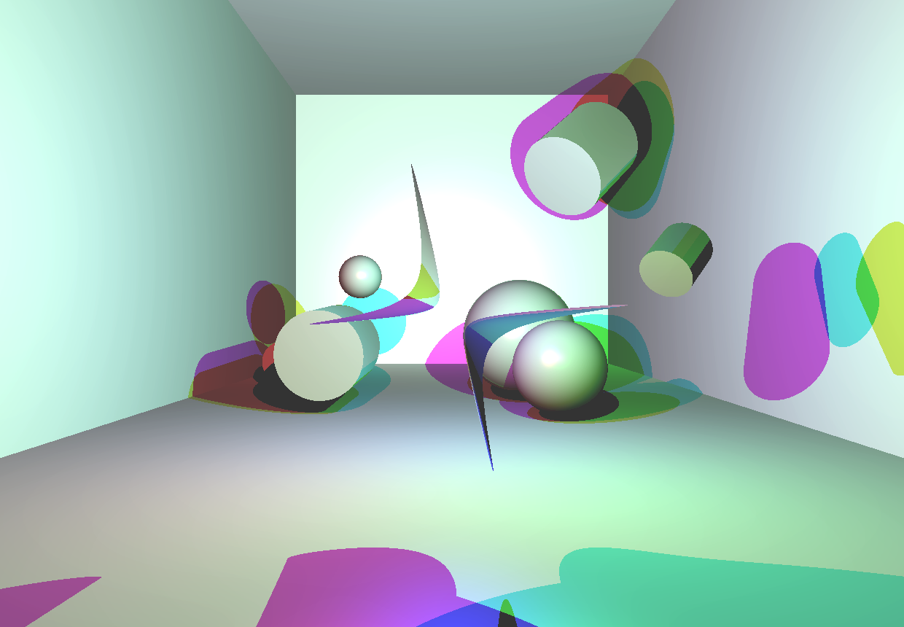
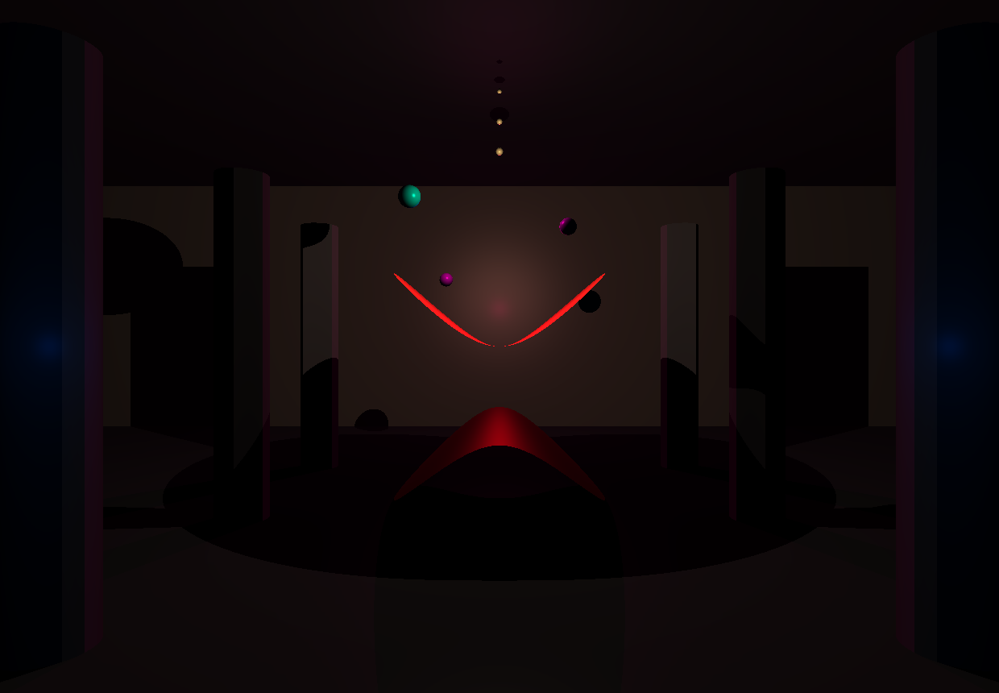
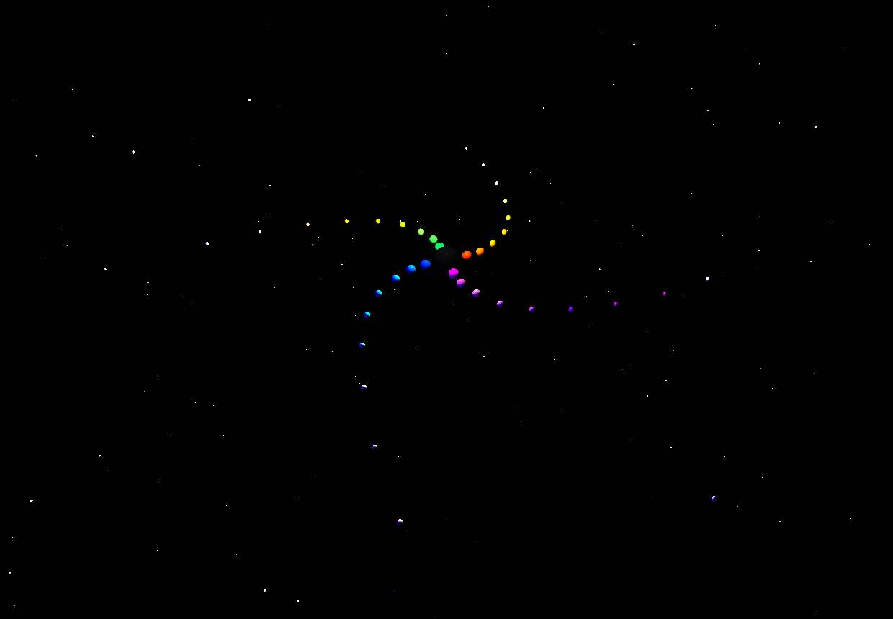

# miniRT


A Raytracer built from scratch in C using **MiniLibX**, a minimal graphics library restricted to single pixel manipulation.
This engine renders computer-generated images by tracing the path of light rays through pixels in an image plane and simulating the effects of its encounters with virtual objects.

## Gallery

<div align="center">
  
  
</div>
<div align="center">
  
  
</div>
<div align="center">
  
  
</div>

---

## Features

*   **Primitives**: Sphere, Plane, Cylinder, Hyperbolic Paraboloid.
*   **Lighting**:
    *   Ambient lighting.
    *   Diffuse shading.
    *   Hard shadows.
    *   Multiple light sources.
    *   Colored lights support.
    *   Phong reflection model (Specular highlights).
*   **Camera**: Moveable camera with FOV control.
*   **System**:
    *   BMP export capability.
    *   Clean memory management.

## Installation & Usage

### Linux prerequisites  
Before building on Linux (or WSL), install the MiniLibX dependencies:
```bash
sudo apt-get update
sudo apt-get install xorg libxext-dev zlib1g-dev libbsd-dev
```

### Build
```bash
make
```

### Run
```bash
./miniRT scenes/galaxy.rt
```

### Export Image
Render scene without opening window and save to BMP:
```bash
./miniRT scenes/galaxy.rt --save
```

### Batch Rendering
To render all scenes present in `scenes/` automatically:
```bash
python3 render_all.py
```

## 📂 Project Structure

*   `scenes/`: Contains all `.rt` scene description files.
*   `results/`: Rendered images.
*   `srcs/`: Source code.
*   `includes/`: Header files.

## 🎮 Controls

Interact with the scene at runtime using the mouse and terminal.

| Input | Action |
| :--- | :--- |
| **Left Click** | Select an object to view its properties. Click background for Scene info. |
| **Q** | Unselect current object. |
| **C** | Edit Mode. Modify the currently selected item via terminal. |
| **ESC** | Close program. |

### 📝 Edit Mode Guide
After pressing **C**, look at your terminal:
*   **Modify**: Type new values when prompted to update coordinates or properties.
*   **Delete Object**: Press `ENTER` (input nothing) for every prompt when editing an object.
*   **Scene Editing**: If no object is selected, you can modify Camera and Lights.

## Scene Configuration

Scenes are defined in `.rt` files:

| Identifier | Description | Parameters |
| :--- | :--- | :--- |
| **A** | Ambient Light | `ratio` `R,G,B` |
| **C** | Camera | `x,y,z` `vec_x,vec_y,vec_z` `FOV` |
| **L** | Light | `x,y,z` `brightness` `R,G,B` |
| **sp** | Sphere | `x,y,z` `diameter` `R,G,B` |
| **pl** | Plane | `x,y,z` `norm_x,norm_y,norm_z` `R,G,B` |
| **cy** | Cylinder | `x,y,z` `norm_x,norm_y,norm_z` `diameter` `height` `R,G,B` |
| **h_p** | Hyperbolic Paraboloid | `parameters(A,B,C,D,E,F,G)` `size` `R,G,B` |


---


